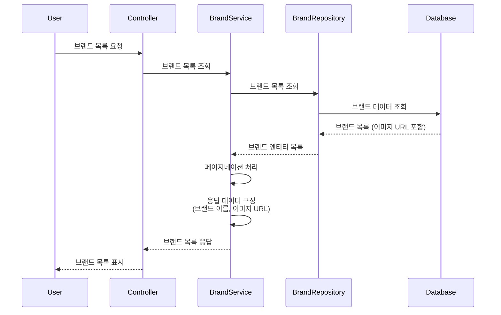
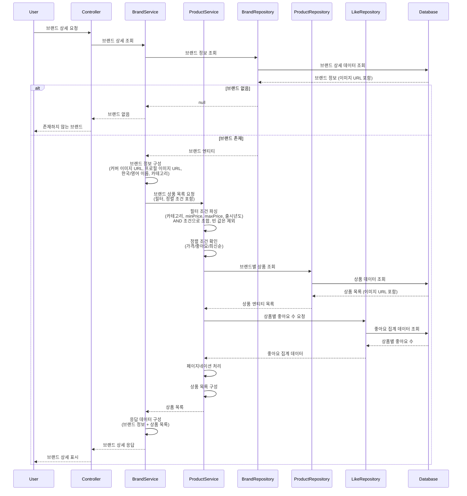
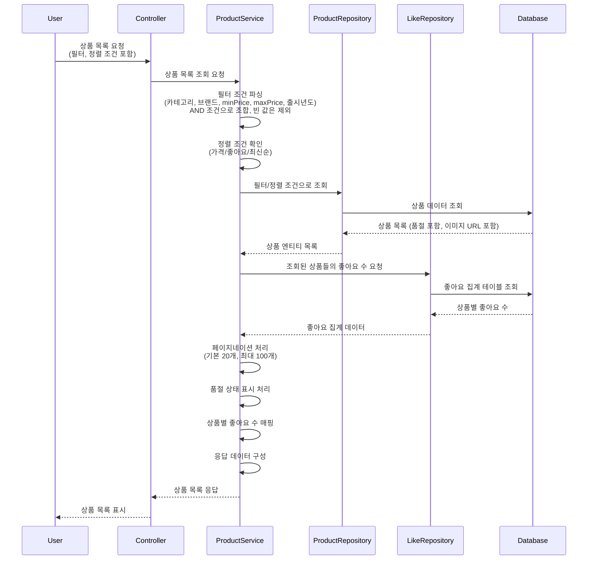
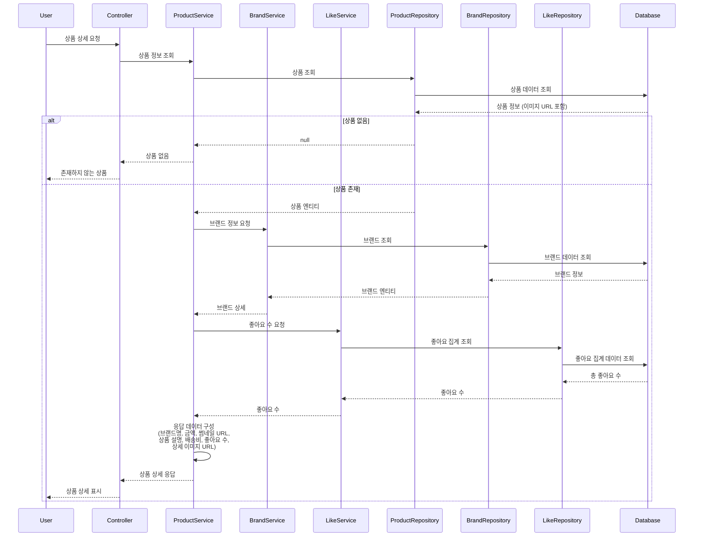
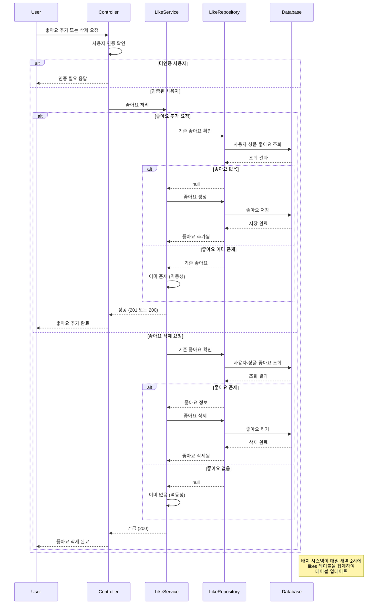
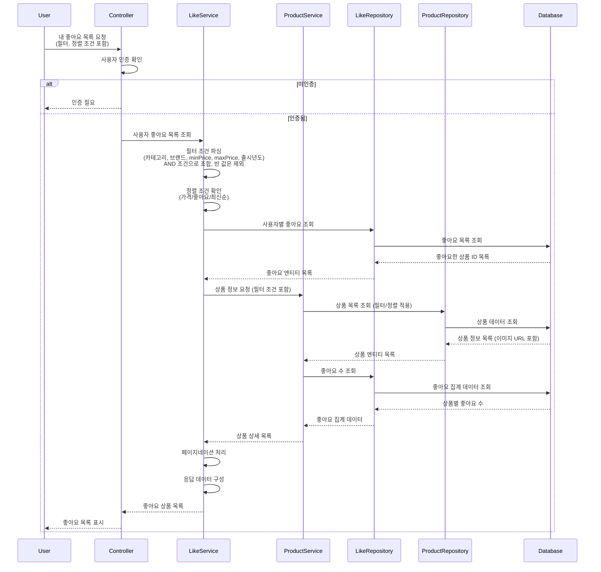
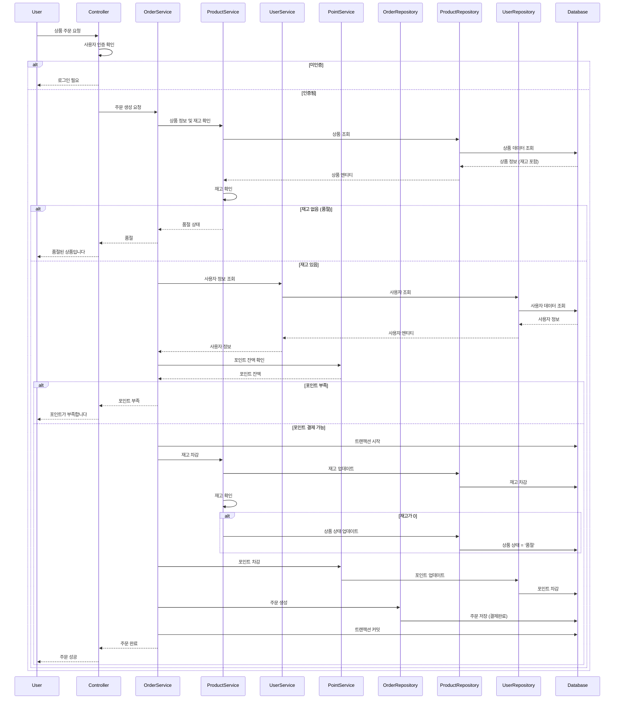
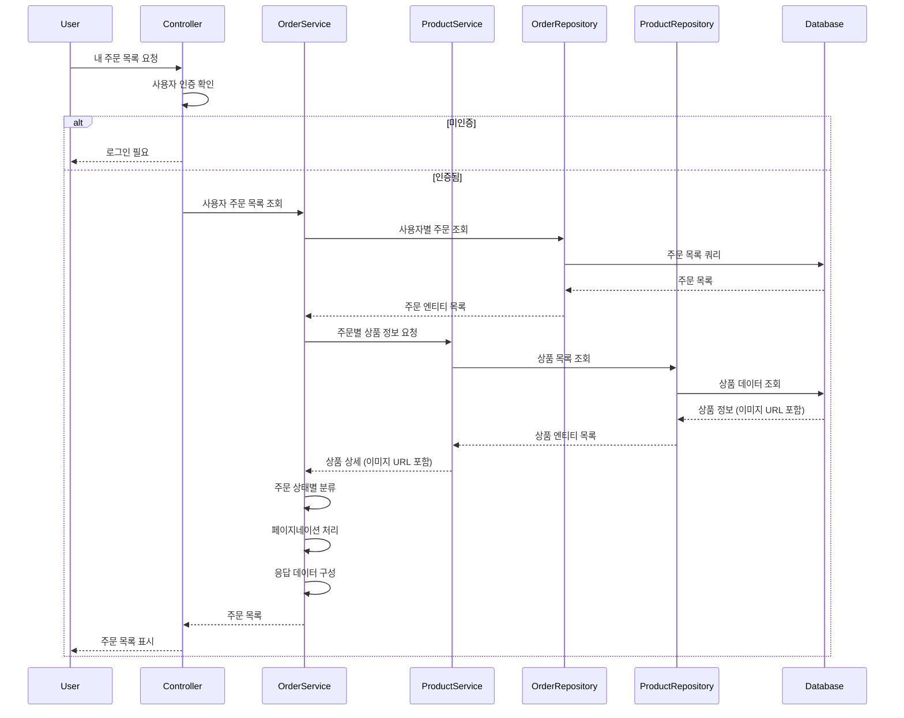
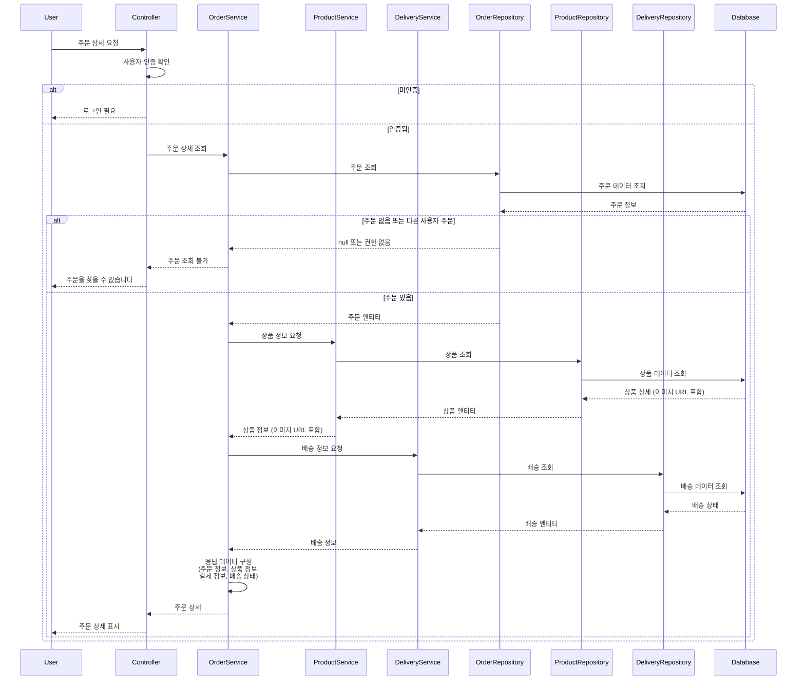

## 1. 브랜드 목록 조회

```mermaid
sequenceDiagram
    participant U as User
    participant C as Controller
    participant BS as BrandService
    participant BR as BrandRepository
    participant DB as Database

    U->>C: 브랜드 목록 요청
    C->>BS: 브랜드 목록 조회
    BS->>BR: 브랜드 목록 조회
    BR->>DB: 브랜드 데이터 조회
    DB-->>BR: 브랜드 목록 (이미지 URL 포함)
    BR-->>BS: 브랜드 엔티티 목록
    
    BS->>BS: 페이지네이션 처리
    BS->>BS: 응답 데이터 구성<br/>(브랜드 이름, 이미지 URL)
    
    BS-->>C: 브랜드 목록 응답
    C-->>U: 브랜드 목록 표시
```

## 2. 브랜드 상세 조회

```mermaid
sequenceDiagram
    participant U as User
    participant C as Controller
    participant BS as BrandService
    participant PS as ProductService
    participant BR as BrandRepository
    participant PR as ProductRepository
    participant LR as LikeRepository
    participant DB as Database

    U->>C: 브랜드 상세 요청
    C->>BS: 브랜드 상세 조회
    
    BS->>BR: 브랜드 정보 조회
    BR->>DB: 브랜드 상세 데이터 조회
    DB-->>BR: 브랜드 정보 (이미지 URL 포함)
    
    alt 브랜드 없음
        BR-->>BS: null
        BS-->>C: 브랜드 없음
        C-->>U: 존재하지 않는 브랜드
    else 브랜드 존재
        BR-->>BS: 브랜드 엔티티
        
        BS->>BS: 브랜드 정보 구성<br/>(커버 이미지 URL, 프로필 이미지 URL,<br/>한국/영어 이름, 카테고리)
        
        BS->>PS: 브랜드 상품 목록 요청<br/>(필터, 정렬 조건 포함)
        PS->>PS: 필터 조건 파싱<br/>(카테고리, minPrice, maxPrice, 출시년도)<br/>AND 조건으로 조합, 빈 값은 제외
        PS->>PS: 정렬 조건 확인<br/>(가격/좋아요/최신순)
        
        PS->>PR: 브랜드별 상품 조회
        PR->>DB: 상품 데이터 조회
        DB-->>PR: 상품 목록 (이미지 URL 포함)
        PR-->>PS: 상품 엔티티 목록
        
        PS->>LR: 상품별 좋아요 수 요청
        LR->>DB: 좋아요 집계 데이터 조회
        DB-->>LR: 상품별 좋아요 수
        LR-->>PS: 좋아요 집계 데이터
        
        PS->>PS: 페이지네이션 처리
        PS->>PS: 상품 목록 구성
        PS-->>BS: 상품 목록
        
        BS->>BS: 응답 데이터 구성<br/>(브랜드 정보 + 상품 목록)
        BS-->>C: 브랜드 상세 응답
        C-->>U: 브랜드 상세 표시
    end
```

## 3. 상품 목록 조회

```mermaid
sequenceDiagram
    participant U as User
    participant C as Controller
    participant PS as ProductService
    participant PR as ProductRepository
    participant LR as LikeRepository
    participant DB as Database

    U->>C: 상품 목록 요청<br/>(필터, 정렬 조건 포함)
    C->>PS: 상품 목록 조회 요청
    
    PS->>PS: 필터 조건 파싱<br/>(카테고리, 브랜드, minPrice, maxPrice, 출시년도)<br/>AND 조건으로 조합, 빈 값은 제외
    PS->>PS: 정렬 조건 확인<br/>(가격/좋아요/최신순)
    
    PS->>PR: 필터/정렬 조건으로 조회
    PR->>DB: 상품 데이터 조회
    DB-->>PR: 상품 목록 (품절 포함, 이미지 URL 포함)
    PR-->>PS: 상품 엔티티 목록
    
    PS->>LR: 조회된 상품들의 좋아요 수 요청
    LR->>DB: 좋아요 집계 테이블 조회
    DB-->>LR: 상품별 좋아요 수
    LR-->>PS: 좋아요 집계 데이터
    
    PS->>PS: 페이지네이션 처리<br/>(기본 20개, 최대 100개)
    PS->>PS: 품절 상태 표시 처리
    PS->>PS: 상품별 좋아요 수 매핑
    PS->>PS: 응답 데이터 구성
    
    PS-->>C: 상품 목록 응답
    C-->>U: 상품 목록 표시
```

## 4. 상품 상세 정보 조회

```mermaid
sequenceDiagram
    participant U as User
    participant C as Controller
    participant PS as ProductService
    participant BS as BrandService
    participant LS as LikeService
    participant PR as ProductRepository
    participant BR as BrandRepository
    participant LR as LikeRepository
    participant DB as Database

    U->>C: 상품 상세 요청
    C->>PS: 상품 정보 조회
    
    PS->>PR: 상품 조회
    PR->>DB: 상품 데이터 조회
    DB-->>PR: 상품 정보 (이미지 URL 포함)
    
    alt 상품 없음
        PR-->>PS: null
        PS-->>C: 상품 없음
        C-->>U: 존재하지 않는 상품
    else 상품 존재
        PR-->>PS: 상품 엔티티
        
        PS->>BS: 브랜드 정보 요청
        BS->>BR: 브랜드 조회
        BR->>DB: 브랜드 데이터 조회
        DB-->>BR: 브랜드 정보
        BR-->>BS: 브랜드 엔티티
        BS-->>PS: 브랜드 상세
        
        PS->>LS: 좋아요 수 요청
        LS->>LR: 좋아요 집계 조회
        LR->>DB: 좋아요 집계 데이터 조회
        DB-->>LR: 총 좋아요 수
        LR-->>LS: 좋아요 수
        LS-->>PS: 좋아요 수
        
        PS->>PS: 응답 데이터 구성<br/>(브랜드명, 금액, 썸네일 URL,<br/>상품 설명, 배송비, 좋아요 수,<br/>상세 이미지 URL)
        
        PS-->>C: 상품 상세 응답
        C-->>U: 상품 상세 표시
    end
```

## 5. 좋아요 등록/취소

```mermaid
sequenceDiagram
    participant U as User
    participant C as Controller
    participant LS as LikeService
    participant LR as LikeRepository
    participant DB as Database

    U->>C: 좋아요 추가 또는 삭제 요청
    C->>C: 사용자 인증 확인
    
    alt 미인증 사용자
        C-->>U: 인증 필요 응답
    else 인증된 사용자
        C->>LS: 좋아요 처리
        
        alt 좋아요 추가 요청
            LS->>LR: 기존 좋아요 확인
            LR->>DB: 사용자-상품 좋아요 조회
            DB-->>LR: 조회 결과
            
            alt 좋아요 없음
                LR-->>LS: null
                LS->>LR: 좋아요 생성
                LR->>DB: 좋아요 저장
                DB-->>LR: 저장 완료
                LR-->>LS: 좋아요 추가됨
            else 좋아요 이미 존재
                LR-->>LS: 기존 좋아요
                LS->>LS: 이미 존재 (멱등성)
            end
            
            LS-->>C: 성공 (201 또는 200)
            C-->>U: 좋아요 추가 완료
            
        else 좋아요 삭제 요청
            LS->>LR: 기존 좋아요 확인
            LR->>DB: 사용자-상품 좋아요 조회
            DB-->>LR: 조회 결과
            
            alt 좋아요 존재
                LR-->>LS: 좋아요 정보
                LS->>LR: 좋아요 삭제
                LR->>DB: 좋아요 제거
                DB-->>LR: 삭제 완료
                LR-->>LS: 좋아요 삭제됨
            else 좋아요 없음
                LR-->>LS: null
                LS->>LS: 이미 없음 (멱등성)
            end
            
            LS-->>C: 성공 (200)
            C-->>U: 좋아요 삭제 완료
        end
    end
    
    Note right of DB: 배치 시스템이 매일 새벽 2시에<br/>likes 테이블을 집계하여<br/>테이블 업데이트
```

## 6. 내가 좋아요한 상품 목록 조회

```mermaid
sequenceDiagram
    participant U as User
    participant C as Controller
    participant LS as LikeService
    participant PS as ProductService
    participant LR as LikeRepository
    participant PR as ProductRepository
    participant DB as Database

    U->>C: 내 좋아요 목록 요청<br/>(필터, 정렬 조건 포함)
    C->>C: 사용자 인증 확인
    
    alt 미인증
        C-->>U: 인증 필요
    else 인증됨
        C->>LS: 사용자 좋아요 목록 조회
        
        LS->>LS: 필터 조건 파싱<br/>(카테고리, 브랜드, minPrice, maxPrice, 출시년도)<br/>AND 조건으로 조합, 빈 값은 제외
        LS->>LS: 정렬 조건 확인<br/>(가격/좋아요/최신순)
        
        LS->>LR: 사용자별 좋아요 조회
        LR->>DB: 좋아요 목록 조회
        DB-->>LR: 좋아요한 상품 ID 목록
        LR-->>LS: 좋아요 엔티티 목록
        
        LS->>PS: 상품 정보 요청 (필터 조건 포함)
        PS->>PR: 상품 목록 조회 (필터/정렬 적용)
        PR->>DB: 상품 데이터 조회
        DB-->>PR: 상품 정보 목록 (이미지 URL 포함)
        PR-->>PS: 상품 엔티티 목록
        
        PS->>LR: 좋아요 수 조회
        LR->>DB: 좋아요 집계 데이터 조회
        DB-->>LR: 상품별 좋아요 수
        LR-->>PS: 좋아요 집계 데이터
        
        PS-->>LS: 상품 상세 목록
        
        LS->>LS: 페이지네이션 처리
        LS->>LS: 응답 데이터 구성
        
        LS-->>C: 좋아요 상품 목록
        C-->>U: 좋아요 목록 표시
    end
```

## 7. 주문

```mermaid
sequenceDiagram
    participant U as User
    participant C as Controller
    participant OS as OrderService
    participant PS as ProductService
    participant US as UserService
    participant PtS as PointService
    participant OR as OrderRepository
    participant PR as ProductRepository
    participant UR as UserRepository
    participant DB as Database

    U->>C: 상품 주문 요청
    C->>C: 사용자 인증 확인
    
    alt 미인증
        C-->>U: 로그인 필요
    else 인증됨
        C->>OS: 주문 생성 요청
        
        OS->>PS: 상품 정보 및 재고 확인
        PS->>PR: 상품 조회
        PR->>DB: 상품 데이터 조회
        DB-->>PR: 상품 정보 (재고 포함)
        PR-->>PS: 상품 엔티티
        
        PS->>PS: 재고 확인
        
        alt 재고 없음 (품절)
            PS-->>OS: 품절 상태
            OS-->>C: 품절
            C-->>U: 품절된 상품입니다
        else 재고 있음
            OS->>US: 사용자 정보 조회
            US->>UR: 사용자 조회
            UR->>DB: 사용자 데이터 조회
            DB-->>UR: 사용자 정보
            UR-->>US: 사용자 엔티티
            US-->>OS: 사용자 정보
            
            OS->>PtS: 포인트 잔액 확인
            PtS-->>OS: 포인트 잔액
            
            alt 포인트 부족
                OS-->>C: 포인트 부족
                C-->>U: 포인트가 부족합니다
            else 포인트 결제 가능
                OS->>DB: 트랜잭션 시작
                
                OS->>PS: 재고 차감
                PS->>PR: 재고 업데이트
                PR->>DB: 재고 차감
                
                PS->>PS: 재고 확인
                alt 재고가 0
                    PS->>PR: 상품 상태 업데이트
                    PR->>DB: 상품 상태 = '품절'
                end
                
                OS->>PtS: 포인트 차감
                PtS->>UR: 포인트 업데이트
                UR->>DB: 포인트 차감
                
                OS->>OR: 주문 생성
                OR->>DB: 주문 저장 (결제완료)
                
                OS->>DB: 트랜잭션 커밋
                
                OS-->>C: 주문 완료
                C-->>U: 주문 성공
            end
        end
    end
```

## 8. 내 주문 목록 조회

```mermaid
sequenceDiagram
    participant U as User
    participant C as Controller
    participant OS as OrderService
    participant PS as ProductService
    participant OR as OrderRepository
    participant PR as ProductRepository
    participant DB as Database

    U->>C: 내 주문 목록 요청
    C->>C: 사용자 인증 확인
    
    alt 미인증
        C-->>U: 로그인 필요
    else 인증됨
        C->>OS: 사용자 주문 목록 조회
        
        OS->>OR: 사용자별 주문 조회
        OR->>DB: 주문 목록 쿼리
        DB-->>OR: 주문 목록
        OR-->>OS: 주문 엔티티 목록
        
        OS->>PS: 주문별 상품 정보 요청
        PS->>PR: 상품 목록 조회
        PR->>DB: 상품 데이터 조회
        DB-->>PR: 상품 정보 (이미지 URL 포함)
        PR-->>PS: 상품 엔티티 목록
        
        PS-->>OS: 상품 상세 (이미지 URL 포함)
        
        OS->>OS: 주문 상태별 분류
        OS->>OS: 페이지네이션 처리
        OS->>OS: 응답 데이터 구성
        
        OS-->>C: 주문 목록
        C-->>U: 주문 목록 표시
    end
```

## 9. 단일 주문 상세 조회

```mermaid
sequenceDiagram
    participant U as User
    participant C as Controller
    participant OS as OrderService
    participant PS as ProductService
    participant DS as DeliveryService
    participant OR as OrderRepository
    participant PR as ProductRepository
    participant DR as DeliveryRepository
    participant DB as Database

    U->>C: 주문 상세 요청
    C->>C: 사용자 인증 확인
    
    alt 미인증
        C-->>U: 로그인 필요
    else 인증됨
        C->>OS: 주문 상세 조회
        
        OS->>OR: 주문 조회
        OR->>DB: 주문 데이터 조회
        DB-->>OR: 주문 정보
        
        alt 주문 없음 또는 다른 사용자 주문
            OR-->>OS: null 또는 권한 없음
            OS-->>C: 주문 조회 불가
            C-->>U: 주문을 찾을 수 없습니다
        else 주문 있음
            OR-->>OS: 주문 엔티티
            
            OS->>PS: 상품 정보 요청
            PS->>PR: 상품 조회
            PR->>DB: 상품 데이터 조회
            DB-->>PR: 상품 상세 (이미지 URL 포함)
            PR-->>PS: 상품 엔티티
            
            PS-->>OS: 상품 정보 (이미지 URL 포함)
            
            OS->>DS: 배송 정보 요청
            DS->>DR: 배송 조회
            DR->>DB: 배송 데이터 조회
            DB-->>DR: 배송 상태
            DR-->>DS: 배송 엔티티
            DS-->>OS: 배송 정보
            
            OS->>OS: 응답 데이터 구성<br/>(주문 정보, 상품 정보,<br/>결제 정보, 배송 상태)
            
            OS-->>C: 주문 상세
            C-->>U: 주문 상세 표시
        end
    end
```
