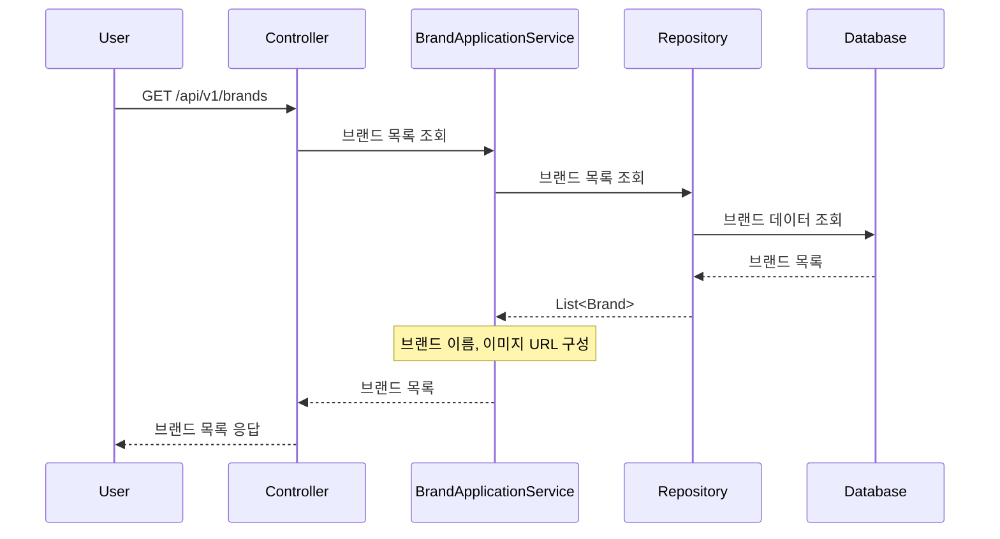
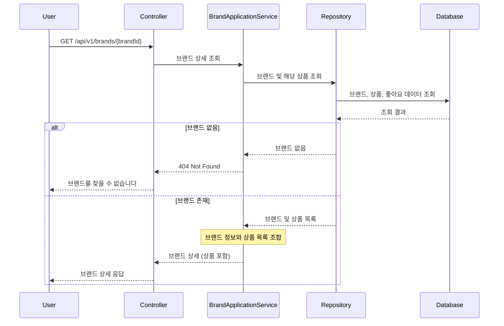
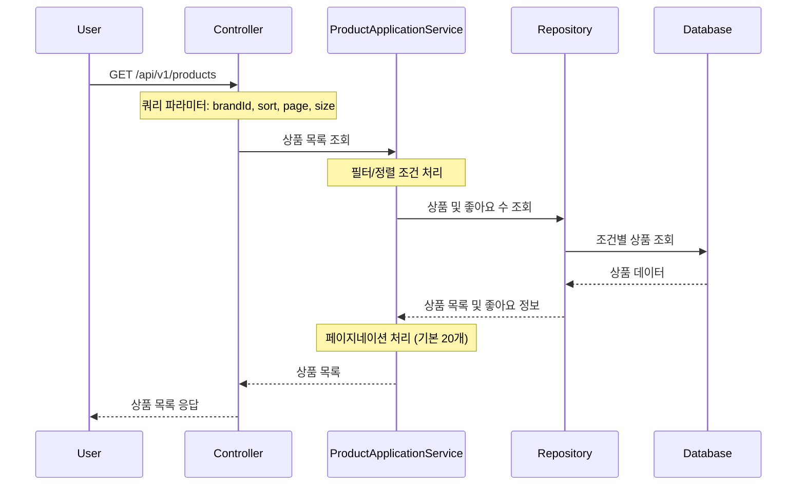
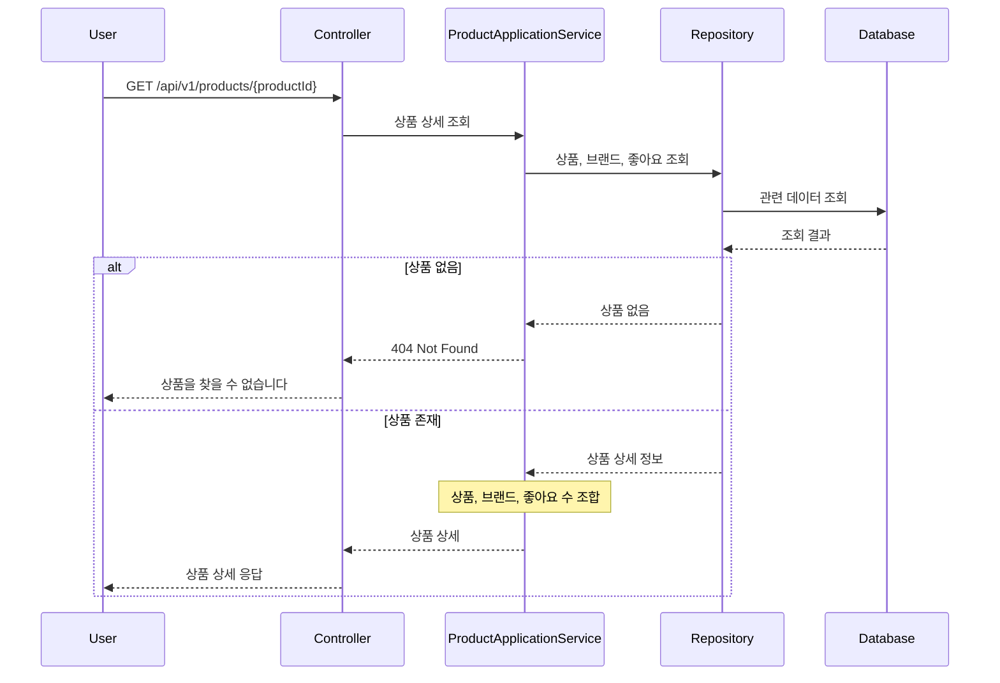
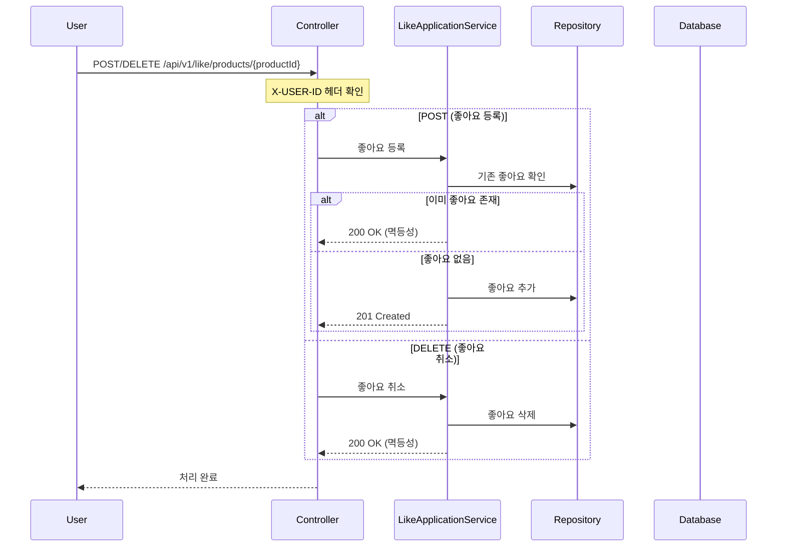
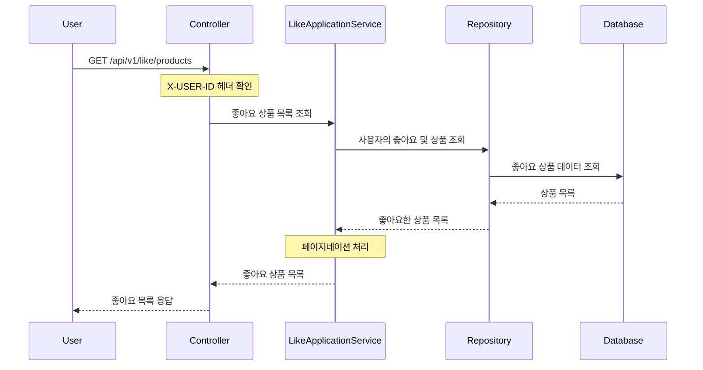
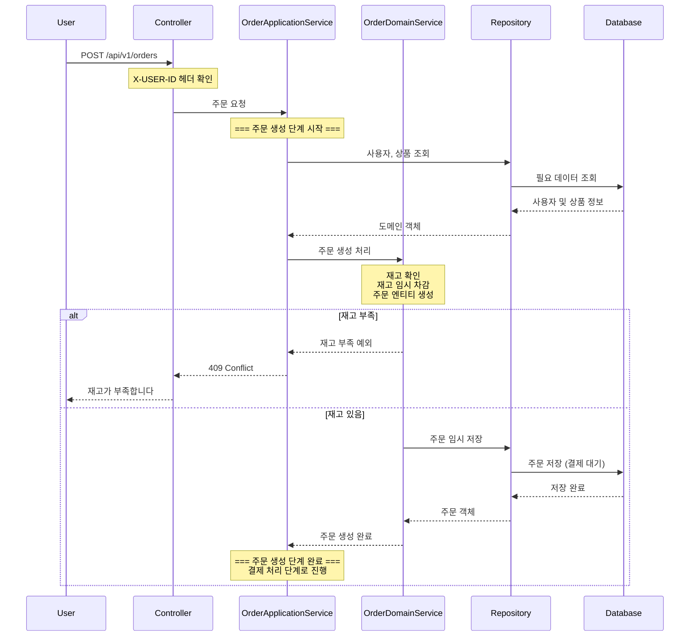
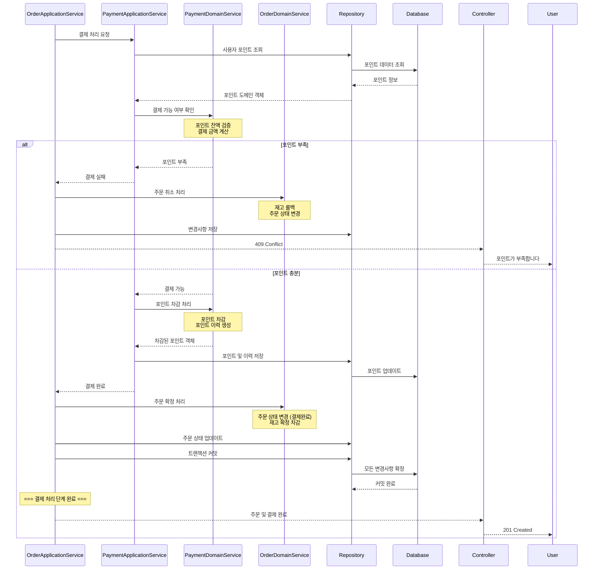
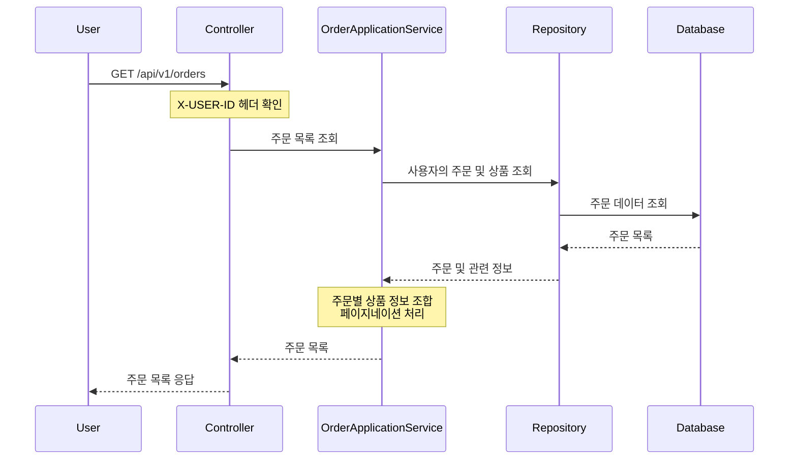
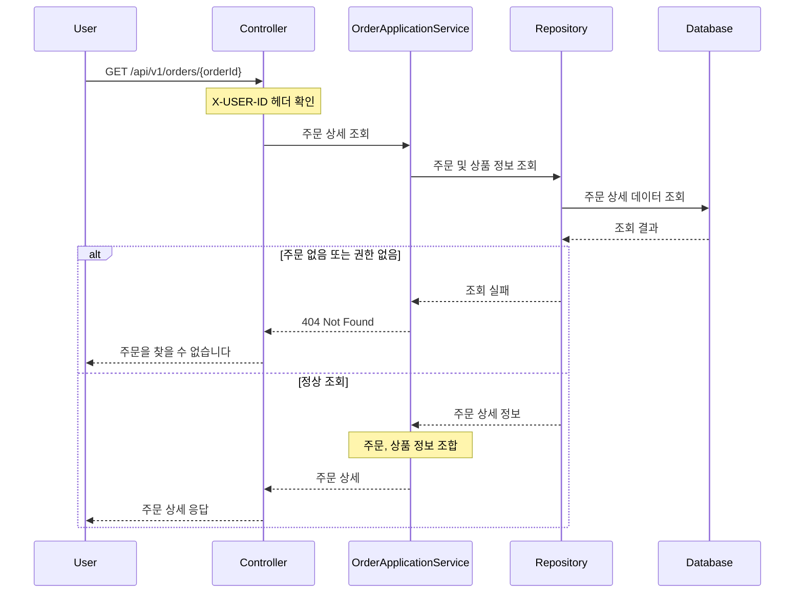

## 1. 브랜드 목록 조회

## 2. 브랜드 상세 조회 (상품 목록 포함)

## 3. 상품 목록 조회

## 4. 상품 상세 조회

## 5. 좋아요 등록/취소

## 6. 내가 좋아요한 상품 목록

## 7. 주문 생성 단계 (주문 API 내부 - 1단계)

## 8. 결제 처리 단계 (주문 API 내부 - 2단계)

## 9. 주문 목록 조회

## 10. 주문 상세 조회

