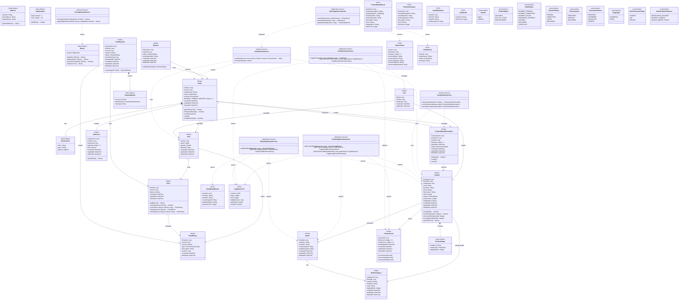

```mermaid
classDiagram
    %% Value Objects
    class Money {
        <<Value Object>>
        -amount: BigDecimal
        +add(other: Money): Money
        +subtract(other: Money): Money
        +isGreaterThan(other: Money): boolean
        +of(amount: int): Money
    }

    class Address {
        <<Value Object>>
        -zipCode: String
        -baseAddress: String
        -detailAddress: String
        +getFullAddress(): String
    }

    class ReceiverInfo {
        <<Value Object>>
        -name: String
        -phone: String
        -address: Address
    }

    class PageRequest {
        <<Value Object>>
        +page: Integer = 1
        +size: Integer = 20
        +getOffset(): Integer
    }

    %% Domain Entities
    class User {
        <<Entity>>
        +userId: Long
        +email: String
        +gender: Gender
        +birthDate: Date
        +createdAt: DateTime
        +updatedAt: DateTime
        +deletedAt: DateTime
    }

    class Point {
        <<Entity>>
        +pointId: Long
        +userId: Long
        -balance: Money
        +createdAt: DateTime
        +updatedAt: DateTime
        +deletedAt: DateTime
        +getBalance(): Money
        +canPay(amount: Money): boolean
        +use(amount: Money, orderId: Long): PointHistory
        +charge(amount: Money): PointHistory
        +refund(amount: Money, orderId: Long): PointHistory
    }

    class PointHistory {
        <<Entity>>
        +historyId: Long
        +userId: Long
        +amount: Money
        +type: PointTransactionType
        +description: String
        +orderId: Long
        +createdAt: DateTime
        +deletedAt: DateTime
    }

    class Product {
        <<Entity>>
        +productId: Long
        +brandId: Long
        +categoryId: Long
        +code: String
        +nameKo: String
        +price: Money
        +description: String
        -stock: Integer
        +status: ProductStatus
        +releaseYear: Integer
        +shippingFee: Money
        +createdAt: DateTime
        +updatedAt: DateTime
        +deletedAt: DateTime
        +isAvailable(): boolean
        +hasStock(quantity: Integer): boolean
        +decreaseStock(quantity: Integer)
        +increaseStock(quantity: Integer)
        +getTotalPrice(): Money
    }

    class Brand {
        <<Entity>>
        +brandId: Long
        +nameKo: String
        +nameEn: String
        +coverImageUrl: String
        +profileImageUrl: String
        +createdAt: DateTime
        +updatedAt: DateTime
        +deletedAt: DateTime
    }

    class BrandCategory {
        <<Entity>>
        +categoryId: Long
        +brandId: Long
        +nameKo: String
        +nameEn: String
        +code: String
        +displayOrder: Integer
        +createdAt: DateTime
        +updatedAt: DateTime
        +deletedAt: DateTime
    }

    class Order {
        <<Entity>>
        +orderId: Long
        +userId: Long
        +totalAmount: Money
        +status: OrderStatus
        +receiver: ReceiverInfo
        -PAYMENT_TIMEOUT_MINUTES: Integer = 3
        +createdAt: DateTime
        +updatedAt: DateTime
        +deletedAt: DateTime
        +getTotalAmount(): Money
        +isPaymentExpired(): boolean
        +confirmPayment()
        +cancel()
        +canBeCancelled(): boolean
    }

    class OrderLine {
        <<Entity>>
        +orderLineId: Long
        +orderId: Long
        +productId: Long
        +quantity: Integer = 1
        +price: Money
        +createdAt: DateTime
        +updatedAt: DateTime
        +deletedAt: DateTime
        +getSubtotal(): Money
    }

    class ProductStockReservation {
        <<Entity>>
        +reservationId: Long
        +productId: Long
        +orderId: Long
        +quantity: Integer = 1
        +expiredAt: DateTime
        +status: ReservationStatus
        +createdAt: DateTime
        +updatedAt: DateTime
        +deletedAt: DateTime
        +isExpired(): boolean
        +confirm()
        +cancel()
    }

    class Like {
        <<Entity>>
        +likeId: Long
        +userId: Long
        +productId: Long
        +createdAt: DateTime
        +deletedAt: DateTime
    }

    class ProductCount {
        <<Entity>>
        +productId: Long
        +likeCount: Integer = 0
        +orderCount: Integer = 0
        +lastUpdatedAt: DateTime
        +createdAt: DateTime
        +updatedAt: DateTime
        +deletedAt: DateTime
        +incrementLikeCount()
        +decrementLikeCount()
        +incrementOrderCount()
    }

    class PointPayment {
        <<Entity>>
        +paymentId: Long
        +orderId: Long
        +userId: Long
        +amount: Money
        +status: PaymentStatus
        +pointHistoryId: Long
        +attemptedAt: DateTime
        +createdAt: DateTime
        +updatedAt: DateTime
        +deletedAt: DateTime
        +execute(point: Point): PaymentResult
    }

    class PaymentResult {
        <<Value Object>>
        +success: boolean
        +failureReason: PaymentFailureReason
        +message: String
    }

    class Delivery {
        <<Entity>>
        +deliveryId: Long
        +orderId: Long
        +status: DeliveryStatus
        +trackingNumber: String
        +createdAt: DateTime
        +updatedAt: DateTime
        +deletedAt: DateTime
        +updateStatus(status: DeliveryStatus)
    }

    class ProductImage {
        <<Value Object>>
        +imageUrl: String
        +imageType: ImageType
        +displayOrder: Integer
    }

    %% Domain Services
    class OrderDomainService {
        <<Domain Service>>
        +createOrder(user: User, product: Product, receiver: ReceiverInfo): Order
        +cancelOrder(order: Order)
    }

    class StockDomainService {
        <<Domain Service>>
        +reserveStock(product: Product): ProductStockReservation
        +confirmReservation(reservation: ProductStockReservation)
        +cancelReservation(reservation: ProductStockReservation)
    }

    class PricingDomainService {
        <<Domain Service>>
        +calculateOrderAmount(product: Product): Money
        +applyShippingFee(subtotal: Money, shippingFee: Money): Money
    }

    %% Application Services
    class ProductApplicationService {
        <<Application Service>>
        +getProductDetail(productId: Long): ProductDetailResult
        +getProductList(pageRequest: PageRequest): PageResult[ProductSummary]
        +getProductListByBrand(brandId: Long, pageRequest: PageRequest): PageResult[ProductSummary]
    }

    class OrderApplicationService {
        <<Application Service>>
        +createOrder(criteria: OrderCriteria): OrderResult
        +cancelOrder(orderId: Long): OrderResult
        +getOrderDetail(orderId: Long): OrderDetailResult
    }

    class LikeApplicationService {
        <<Application Service>>
        +toggleLike(userId: Long, productId: Long): LikeResult
        +getUserLikedProducts(userId: Long, pageRequest: PageRequest): PageResult[ProductSummary]
    }

    class BrandApplicationService {
        <<Application Service>>
        +getBrandDetail(brandId: Long): BrandDetailResult
        +getBrandList(pageRequest: PageRequest): PageResult[BrandSummary]
    }

    %% DTOs (Criteria/Result)
    class OrderCriteria {
        <<DTO>>
        +userId: Long
        +productId: Long
        +quantity: Integer = 1
        +receiverName: String
        +receiverPhone: String
        +receiverZipCode: String
        +receiverAddress: String
        +receiverAddressDetail: String
    }

    class OrderResult {
        <<DTO>>
        +orderId: Long
        +totalAmount: Money
        +status: OrderStatus
        +message: String
    }

    class ProductDetailResult {
        <<DTO>>
        +productId: Long
        +thumbnailImageUrl: String
        +detailImageUrls: List[String]
        +brandNameKo: String
        +productNameKo: String
        +description: String
        +price: Money
        +shippingFee: Money
        +likeCount: Integer
    }

    class ProductSummary {
        <<DTO>>
        +productId: Long
        +thumbnailImageUrl: String
        +brandNameKo: String
        +productNameKo: String
        +description: String
        +price: Money
        +likeCount: Integer
    }

    class BrandDetailResult {
        <<DTO>>
        +brandId: Long
        +nameKo: String
        +nameEn: String
        +coverImageUrl: String
        +profileImageUrl: String
        +productCount: Integer
    }

    class BrandSummary {
        <<DTO>>
        +brandId: Long
        +nameKo: String
        +nameEn: String
        +profileImageUrl: String
    }

    class PageResult~T~ {
        <<DTO>>
        +content: List[T]
        +page: Integer
        +size: Integer
        +totalElements: Long
        +totalPages: Integer
        +hasNext: boolean
    }

    class LikeResult {
        <<DTO>>
        +isLiked: boolean
        +likeCount: Integer
    }

    %% Enumerations
    class Gender {
        <<enumeration>>
        MALE
        FEMALE
    }

    class ProductStatus {
        <<enumeration>>
        AVAILABLE
        OUT_OF_STOCK
        DISCONTINUED
    }

    class OrderStatus {
        <<enumeration>>
        PAYMENT_PENDING
        PAYMENT_COMPLETED
        PAYMENT_FAILED
        PREPARING_SHIPMENT
        SHIPPING
        DELIVERED
        CANCELLED
    }

    class PaymentStatus {
        <<enumeration>>
        PENDING
        COMPLETED
        FAILED
        REFUNDED
    }

    class DeliveryStatus {
        <<enumeration>>
        PREPARING
        SHIPPING
        DELIVERED
    }

    class ReservationStatus {
        <<enumeration>>
        RESERVED
        CONFIRMED
        CANCELLED
        EXPIRED
    }

    class ImageType {
        <<enumeration>>
        THUMBNAIL
        DETAIL
    }

    class PointTransactionType {
        <<enumeration>>
        CHARGE
        USE
        REFUND
    }

    class PaymentFailureReason {
        <<enumeration>>
        INSUFFICIENT_BALANCE
        PAYMENT_TIMEOUT
        INVALID_ORDER_STATUS
    }

    %% Relationships
    %% User Aggregate
    User "1" --> "1" Point : owns
    User "1" --> "*" PointHistory : tracks
    
    %% Point
    Point "1" --> "*" PointHistory : manages
    
    %% Product Aggregate
    Product "1" *-- "*" ProductImage : contains
    Product "*" --> "1" Brand : belongsTo
    Product "*" --> "1" BrandCategory : categorizedBy
    Product "1" --> "1" ProductCount : tracks
    
    %% Brand Aggregate
    Brand "1" --> "*" BrandCategory : has
    
    %% Order Aggregate
    Order "1" *-- "*" OrderLine : contains
    Order "1" --> "*" ProductStockReservation : creates
    Order "*" --> "1" User : placedBy
    Order "1" *-- "1" ReceiverInfo : has
    
    %% Payment
    PointPayment "*" --> "1" Order : pays
    PointPayment "*" --> "1" Point : uses
    PointPayment "1" --> "1" PointHistory : creates
    PointPayment "1" *-- "1" PaymentResult : returns
    
    %% Delivery
    Delivery "*" --> "1" Order : delivers
    
    %% Like
    Like "*" --> "1" User : createdBy
    Like "*" --> "1" Product : targets
    
    %% Stock Management
    ProductStockReservation "*" --> "1" Product : reserves
    ProductStockReservation "*" --> "1" Order : belongsTo
    
    %% Domain Services relationships
    OrderDomainService ..> Order : creates
    OrderDomainService ..> User : uses
    OrderDomainService ..> Product : uses
    
    StockDomainService ..> ProductStockReservation : manages
    StockDomainService ..> Product : uses
    
    PricingDomainService ..> Money : returns
    
    %% Application Services relationships
    ProductApplicationService ..> Product : queries
    ProductApplicationService ..> Brand : queries
    ProductApplicationService ..> ProductCount : queries
    ProductApplicationService ..> PageResult : returns
    
    OrderApplicationService ..> OrderDomainService : delegates
    OrderApplicationService ..> OrderCriteria : receives
    OrderApplicationService ..> OrderResult : returns
    
    LikeApplicationService ..> Like : manages
    LikeApplicationService ..> ProductCount : updates
    LikeApplicationService ..> PageResult : returns
    
    BrandApplicationService ..> Brand : queries
    BrandApplicationService ..> Product : queries
    BrandApplicationService ..> BrandDetailResult : returns
    BrandApplicationService ..> PageResult : returns
```
