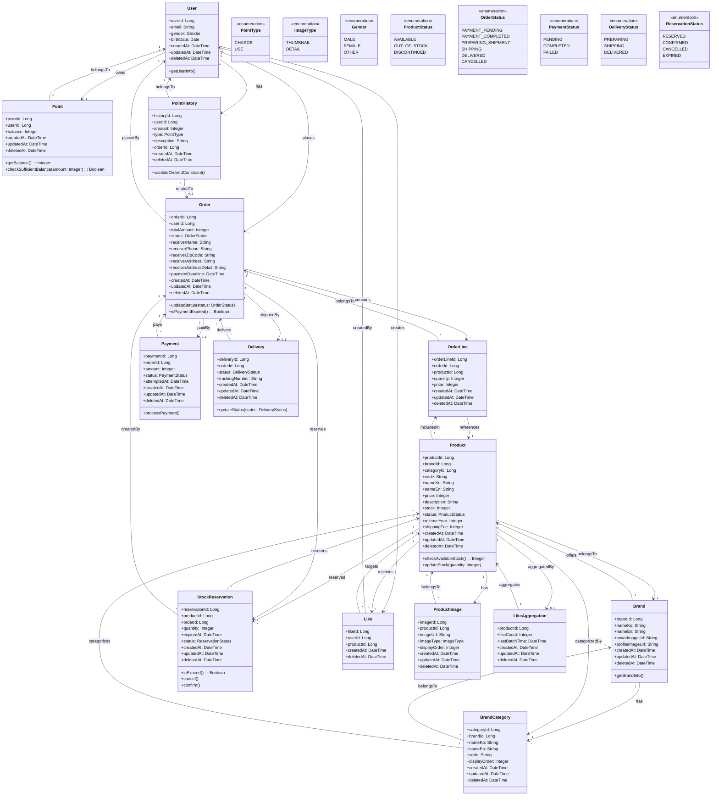

```mermaid
classDiagram
    class User {
        +userId: Long
        +email: String
        +gender: Gender
        +birthDate: Date
        +createdAt: DateTime
        +updatedAt: DateTime
        +deletedAt: DateTime
        +getUserInfo()
    }

    class Point {
        +pointId: Long
        +userId: Long
        +balance: Integer
        +createdAt: DateTime
        +updatedAt: DateTime
        +deletedAt: DateTime
        +getBalance(): Integer
        +checkSufficientBalance(amount: Integer): Boolean
    }

    class PointHistory {
        +historyId: Long
        +userId: Long
        +amount: Integer
        +type: PointType
        +description: String
        +orderId: Long
        +createdAt: DateTime
        +deletedAt: DateTime
        +validateOrderIdConstraint()
    }

    class PointType {
        <<enumeration>>
        CHARGE
        USE
    }

    class Product {
        +productId: Long
        +brandId: Long
        +categoryId: Long
        +code: String
        +nameKo: String
        +nameEn: String
        +price: Integer
        +description: String
        +stock: Integer
        +status: ProductStatus
        +releaseYear: Integer
        +shippingFee: Integer
        +createdAt: DateTime
        +updatedAt: DateTime
        +deletedAt: DateTime
        +checkAvailableStock(): Integer
        +updateStock(quantity: Integer)
    }

    class Brand {
        +brandId: Long
        +nameKo: String
        +nameEn: String
        +coverImageUrl: String
        +profileImageUrl: String
        +createdAt: DateTime
        +updatedAt: DateTime
        +deletedAt: DateTime
        +getBrandInfo()
    }

    class BrandCategory {
        +categoryId: Long
        +brandId: Long
        +nameKo: String
        +nameEn: String
        +code: String
        +displayOrder: Integer
        +createdAt: DateTime
        +updatedAt: DateTime
        +deletedAt: DateTime
    }

    class StockReservation {
        +reservationId: Long
        +productId: Long
        +orderId: Long
        +quantity: Integer
        +expiredAt: DateTime
        +status: ReservationStatus
        +createdAt: DateTime
        +updatedAt: DateTime
        +deletedAt: DateTime
        +isExpired(): Boolean
        +cancel()
        +confirm()
    }

    class Order {
        +orderId: Long
        +userId: Long
        +totalAmount: Integer
        +status: OrderStatus
        +receiverName: String
        +receiverPhone: String
        +receiverZipCode: String
        +receiverAddress: String
        +receiverAddressDetail: String
        +paymentDeadline: DateTime
        +createdAt: DateTime
        +updatedAt: DateTime
        +deletedAt: DateTime
        +updateStatus(status: OrderStatus)
        +isPaymentExpired(): Boolean
    }

    class OrderLine {
        +orderLineId: Long
        +orderId: Long
        +productId: Long
        +quantity: Integer
        +price: Integer
        +createdAt: DateTime
        +updatedAt: DateTime
        +deletedAt: DateTime
    }

    class Like {
        +likeId: Long
        +userId: Long
        +productId: Long
        +createdAt: DateTime
        +deletedAt: DateTime
    }

    class ProductImage {
        +imageId: Long
        +productId: Long
        +imageUrl: String
        +imageType: ImageType
        +displayOrder: Integer
        +createdAt: DateTime
        +updatedAt: DateTime
        +deletedAt: DateTime
    }

    class ImageType {
        <<enumeration>>
        THUMBNAIL
        DETAIL
    }

    class LikeAggregation {
        +productId: Long
        +likeCount: Integer
        +lastBatchTime: DateTime
        +createdAt: DateTime
        +updatedAt: DateTime
        +deletedAt: DateTime
    }

    class Payment {
        +paymentId: Long
        +orderId: Long
        +amount: Integer
        +status: PaymentStatus
        +attemptedAt: DateTime
        +createdAt: DateTime
        +updatedAt: DateTime
        +deletedAt: DateTime
        +processPayment()
    }

    class Delivery {
        +deliveryId: Long
        +orderId: Long
        +status: DeliveryStatus
        +trackingNumber: String
        +createdAt: DateTime
        +updatedAt: DateTime
        +deletedAt: DateTime
        +updateStatus(status: DeliveryStatus)
    }

    class Gender {
        <<enumeration>>
        MALE
        FEMALE
        OTHER
    }

    class ProductStatus {
        <<enumeration>>
        AVAILABLE
        OUT_OF_STOCK
        DISCONTINUED
    }

    class OrderStatus {
        <<enumeration>>
        PAYMENT_PENDING
        PAYMENT_COMPLETED
        PREPARING_SHIPMENT
        SHIPPING
        DELIVERED
        CANCELLED
    }

    class PaymentStatus {
        <<enumeration>>
        PENDING
        COMPLETED
        FAILED
    }

    class DeliveryStatus {
        <<enumeration>>
        PREPARING
        SHIPPING
        DELIVERED
    }

    class ReservationStatus {
        <<enumeration>>
        RESERVED
        CONFIRMED
        CANCELLED
        EXPIRED
    }

    %% Relationships
    User "1" --> "*" Order : places
    User "1" --> "*" Like : creates
    User "1" --> "1" Point : owns
    User "1" --> "*" PointHistory : has
    
    Brand "1" --> "*" BrandCategory : has
    Brand "1" --> "*" Product : offers
    
    BrandCategory "*" --> "1" Brand : belongsTo
    BrandCategory "1" --> "*" Product : categorizes
    
    Product "*" --> "1" Brand : belongsTo
    Product "*" --> "1" BrandCategory : categorizedBy
    Product "1" --> "*" OrderLine : includedIn
    Product "1" --> "*" Like : receives
    Product "1" --> "0..1" LikeAggregation : aggregatedBy
    Product "1" --> "*" ProductImage : has
    Product "1" --> "*" StockReservation : reserved
    
    Order "1" --> "*" OrderLine : contains
    Order "1" --> "0..1" Payment : paidBy
    Order "1" --> "0..1" Delivery : shippedBy
    Order "*" --> "1" User : placedBy
    Order "1" --> "*" StockReservation : reserves
    
    OrderLine "*" --> "1" Product : references
    OrderLine "*" --> "1" Order : belongsTo
    
    Like "*" --> "1" User : createdBy
    Like "*" --> "1" Product : targets
    
    Payment "*" --> "1" Order : pays
    
    Delivery "*" --> "1" Order : delivers
    
    LikeAggregation "1" --> "1" Product : aggregates
    
    ProductImage "*" --> "1" Product : belongsTo
    
    Point "1" --> "1" User : belongsTo
    
    PointHistory "*" --> "1" User : belongsTo
    PointHistory "*" --> "0..1" Order : relatedTo
    
    StockReservation "*" --> "1" Product : reserves
    StockReservation "*" --> "1" Order : createdBy
```
